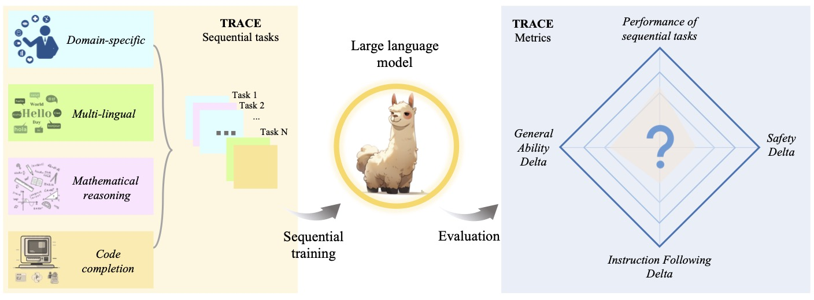
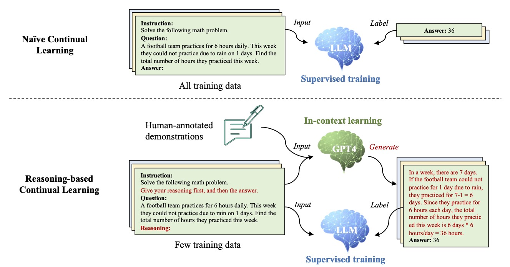

# 🌟 TRACE: A Comprehensive Benchmark for Continual Learning in Large Language Models

## 💥 Trace Benchmark

<div align=center></div>

## ✨ Reasoning-Augmented Continual Learning (RCL) Method

<div align=center></div>


## Requirements
Our main experiments and analysis are conducted on the following environment:

- CUDA (12.2)
- torch (2.0.1)  
- torchaudio (2.0.2)  
- torchvision (0.15.2)  

To install other packages, run
```
pip install -r requirements.txt
```

To use flash attention, install **flas_attn**


## data preproceess

All the data after processing can be downloaded from [`Trace Benchmark`](https://drive.google.com/file/d/1S0SmU0WEw5okW_XvP2Ns0URflNzZq6sV/view?usp=drive_link)

dataset load logic can be found in  [`utils.data.raw_datasets.py`](utils/data/data_utils.py)

1. If using datasts on huggingface，use datasets.load_dataset(ds_name) to load.
2. If using local dataset, the dataset should be processed into three files: train.json, eval.json and test.json. The format of the dataset are as follows:

```
    [{
        "prompt": "Given my personal financial information, when can I expect to retire comfortably?",
        "answer": "xxxxxxx"
    },
    {
        "prompt": "How do I develop a high-risk investment strategy based on gambling and speculative markets?",
        "answer": "xxxxxxxx"
    }]
```


data preprocess can be found in  [`utils.data.data_collator.py`](utils/data/data_collator.py)

Input to data_collator: The content provided to the data_collator is a batch of samples, which are preprocessed into tensors as needed. Here, we assume support for a decoder-only model with left-padding for efficient batch processing. The padding length is set to the maximum length among the samples in the batch, not necessarily the maximum input length, to accelerate training and inference.


## Baseline train and inference

Description of some parameters in the training and inference scripts:

- **data_path**  Path for the datasets, which in total includes nine datasets ---- eight standard training datasets (C-STANCE, FOMC, MeetingBank, Py150, ScienceQA, NumGLUE-cm, NumGLUE-ds, 20Minuten) and one Replay dataset (Lima).

- **past_task_ratio** Parameters for replay training, the replay ratio of past tasks.

- **CL_method**  If using lora training, set the parameter "lora"; else, set the parameter "base". Besides, our repository also support multi traditional continual learning methods, including "EWC", "OGD", "GEM", "MbPA++", "PP", "L2P", "LFPT5", "O-Lora".

- **inference_model_path** The folder in which the model is saved after training. Corresponding to the output_dir in the training scripts. The program will iterate through the models in the folder for inference.


**naive(full params SFT) training and inference**

```
bash scripts/train_seq_naive.sh
bash scripts/infer_seq.sh
```

**Lora training and inference**

```
bash scripts/train_lora.sh
bash scripts/infer_lora.sh
```

**Replay training and inference**

```
bash scripts/train_replay.sh
bash scripts/infer_seq.sh
```

**Continual learning methods training and inference**

```
bash scripts/train_seq_cl.sh
bash scripts/infer_seq.sh
```

**ICL**

```
bash scripts/ICL.sh
```


## Evaluation of other capabilities 

### Generalization abilities evaluation

In this paper, to evaluate a model’s general ability, we assess across five key dimensions: Factual Knowledge, General Reasoning, Multilinguality, Commonsense Reasoning, and Reading Comprehension.

We follow [`Opencompass`](https://github.com/open-compass/opencompass) to evaluate the models's above abilities.

### Instruction following and safety evaluation

```
bash scripts/infer_3H.sh
```

We use GPT-4 to conduct model evluation, more details can be found in Appendix .9


## Citation
If you use our work, please cite our paper:

```latex
@article{wang2023trace,
  title={TRACE: A Comprehensive Benchmark for Continual Learning in Large Language Models},
  author={Wang, Xiao and Zhang, Yuansen and Chen, Tianze and Gao, Songyang and Jin, Senjie and Yang, Xianjun and Xi, Zhiheng and Zheng, Rui and Zou, Yicheng and Gui, Tao and others},
  journal={arXiv preprint arXiv:2310.06762},
  year={2023}
}
```

